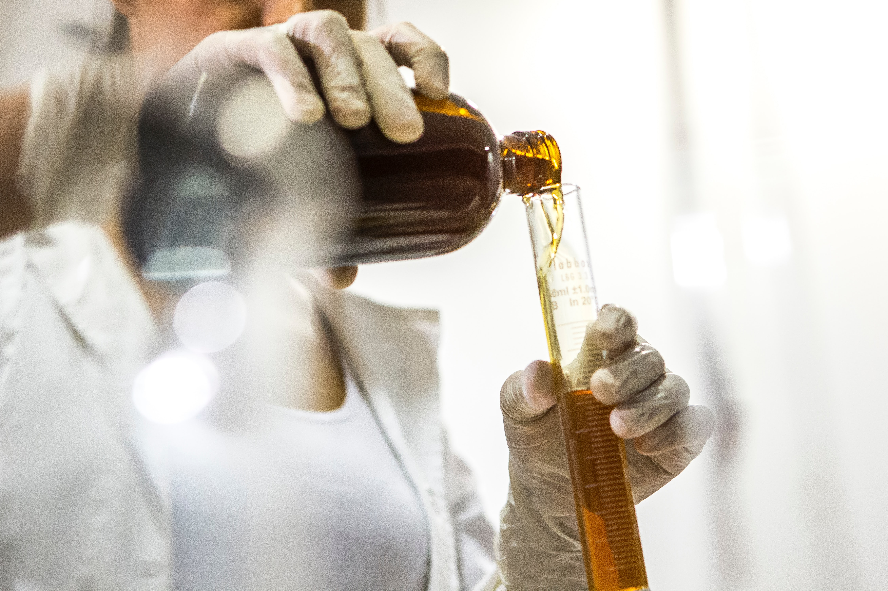

# Cosmetic Products and Skin Type

### Author: Ly Nguyenova

### Introduction

In this project, I have implemented my knowledge in Machine Learning to solve my daily life problem. Most of the work was inspired by the article "For Your Skin Beauty: Mapping Cosmetic Items with Bokeh" by Jiwon Jeong (2018). 

As I have noticed, women are very concerned about their daily skincare routine. The problem, however, is that we, ourselves, either do not know our skin type or online shopping makes it hard to choose any products because of the wide range of choice as well as the ambiguity in ingredients.

Due to this fact, I have decided to apply my knowledge in Data Science to find the relation between skin type and ingredients in cosmetic products which might help customers gain a better shopping experience.

### Methodology

Data obtaining - Web-scraping with BeautifulSoup, websites - Sephora, SpaceNK, Boots, John Lewis

Dimension reduction - PCA, T-SNE

Text mining - NLP, ingredient tokenization, ingredient-term matrix

Data visualisation - interactive plot with Bokeh
<<<<<<< HEAD
Product similarity - content-based recommender system with NLTK
=======

Product similarity - Cosine Similarity
>>>>>>> 9033325d054791919adb7be2a0eecc7e8f9be6b0

### Findings

In order to recommend products solely based on their ingredients, I needed to tokenised all ingredients and create a document-term matrix. From there, classify each ingredient. Therefore, if the ingredient was in the product, it will have an index of 1. If not, the index will be 0.

In the process of reducing the dimension of all the ingredients that I had tokenized, I have realised that PCA could not be conducted on binary data. Therefore, T-SNE was conducted instead as it is easier to find similar products in 2D and it will be visualised in Bokeh better.

With NLP, I have found out the top frequently used ingredients in cosmetic products across all skin types. For each skin type, I have also included the top most used ingredients. 

Bokeh was introduced to help visualise T-SNE. It provides an interactive way to show how T-SNE has clustered all products with similar ingredients. With this tool, we could look for similar products, their price, their ranks as well as their brand names.

Lastly, a function with the Rake package from NLTK library was created to recommend top 10 products in the same category and similar ingredients. It is intended to help customers find the closest alternative products with the one they are currently using.

### Recommendations

As this project was designed to aim at customers who already know their skin type or those who know what ingredients they want to look for in a product according to their skin type. It is recommended that a person should refer to this after finding out their own skin type.

Companies could find this project useful if they want to interact with their customers by showing them the interactive visualisation for a better way of choosing a product based on ingredients. Customers, therefore, could easily see which products have similar ingredients as the one they are using and what the ranking of those products are.
